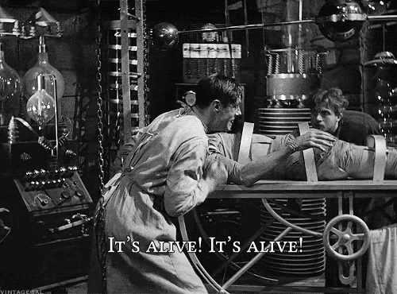

```{r setup, include=FALSE}
options(htmltools.dir.version = FALSE)
knitr::opts_chunk$set(
  fig.retina=3,
  out.width = "70%",
  cache = FALSE,
  echo = T,
  message = FALSE, 
  warning = FALSE,
  hiline = TRUE
)
options(scipen = 999)
```

```{r xaringan-themer, include=FALSE, warning=FALSE}
library(xaringanthemer)
library(tidyverse)
#style_duo_accent(
#  primary_color = "#1381B0",
#  secondary_color = "#FF961C",
#  inverse_header_color = "#FFFFFF"
#)
xaringanExtra::use_panelset()

```


## Contenidos de la clase

- Listas

- Funciones


---

class: inverse center middle

# Listas

---

## ¿Qué son las listas?

.center[

]

--

Estructura que nos permite ordenar datos de distinto tipo 
 

```{r}
mi_lista <- list(1, "perro")
```


---

## Índices de una lista 

Podemos acceder a los elementos mediante sus índices

```{r}
mi_lista[[2]]
```

--

Podemos cambiar los elementos

```{r}
mi_lista[[2]] <- "gato"
mi_lista
```

---

## Agregar alementos  

Puedo agregar elementos a mi lista

.pull-left[

]

.pull-right[

```{r}
mi_lista[[3]] <- "pudú"
mi_lista
```

]


---

## Agregar elementos

También podemos usar append

.pull-left[

]


.pull-right[
```{r}
mi_lista <- append(mi_lista, "puma")
mi_lista
```
]


---
## Agreguemos nombres


```{r}
names(mi_lista) <- c("uno", "gato", "pudu", "puma")
names(mi_lista)
```

--

### Los nombres nos pueden servir como "llaves" 

```{r}
mi_lista$puma <- "El puma es un felino"
```

```{r}
print(mi_lista$puma)
```


---

## Ejercicio express🕞: Lista Simpsons

Crea una lista con tus personajes favoritos de los Simpsons. Asocia una descripción o una frase a cada personaje

Empiezo yo...

```{r}
simpsons <- list("bart" = "siempre molesto a Lisa")
simpsons[["homero"]] <- "anda la osa"


```


---

## Recordando la clase anterior...

Podemos iterar sobre listas

--

```{r}
for (i in mi_lista) {
    print(i)
}
```


---

## Listas anidadas


```{r}
nueva_lista <- list(numeros = c( 2 ,3), animales = c("puma", "pudú", "condor"), bandas = c("queen", "acdc") )
```

--

Comentario al margen: los dataframes en R se implementan como listas

```{r}
df <- data.frame(numeros = c(1, 2 ,3), animales = c("puma", "pudú", "condor"))
typeof(df)
```

---

## Listas anidadas


```{r}
nueva_lista[[3]][2]

nueva_lista$bandas[2]
```

---

## Ejercicio: suma 10

Trabajaremos sobre la siguiente lista de números

```{r, results='hide'}
numeros <- list(1, 5, 9, 34, 98, 76)
```

La idea es iterar sobre la lista `numeros`, sumar 10 a cada elemento y reemplazar el valor original por el resultado de la operación

La función `length` puede ser de utilidad


---

class: inverse center middle

# funciones


---

## Ejemplos de funciones

Ustedes conocen muchas funciones

- mean
- max
- min
- etc

--

A veces, necesitamos crear nuestras propias funciones

---

## DRY: Don't repeat yourself


.center[

]


---

## Ejemplo R for DS

Queremos rescalar las 4 columnas de este *dataframe*, para que estén entre 0 y 1

```{r}
df <- tibble(
  a = rnorm(5),
  b = rnorm(5),
  c = rnorm(5),
  d = rnorm(5),
)

```

$rescale = \frac{ (x - min(x)) }{ (max(x) - min(x))}$


--

```{r}

df  %>%  mutate(
  a = (a - min(a, na.rm = TRUE)) / 
    (max(a, na.rm = TRUE) - min(a, na.rm = TRUE)),
  b = (b - min(b, na.rm = TRUE)) / 
    (max(b, na.rm = TRUE) - min(b, na.rm = TRUE)),
  c = (c - min(c, na.rm = TRUE)) / 
    (max(c, na.rm = TRUE) - min(c, na.rm = TRUE)),
  d = (d - min(d, na.rm = TRUE)) / 
    (max(d, na.rm = TRUE) - min(d, na.rm = TRUE)),
)
```

---

## ¿Cuál es la parte que va variando?


```{r, eval=FALSE}
(a - min(a, na.rm = TRUE)) / (max(a, na.rm = TRUE) - min(a, na.rm = TRUE))
(b - min(b, na.rm = TRUE)) / (max(b, na.rm = TRUE) - min(b, na.rm = TRUE))
(c - min(c, na.rm = TRUE)) / (max(c, na.rm = TRUE) - min(c, na.rm = TRUE))
(d - min(d, na.rm = TRUE)) / (max(d, na.rm = TRUE) - min(d, na.rm = TRUE)) 
```


--

La variable es lo único que va cambiando

---

## Nuestra propia función


```{r}
custom_rescale <- function(x) {
  new_values <-  (x - min(x, na.rm = TRUE)) / (max(x, na.rm = TRUE) - min(x, na.rm = TRUE))
  return(new_values)
}


```

--

```{r}
custom_rescale(rnorm(n = 10))
```


--

.center[

]


---

## Usando nuestra función

```{r}
df %>% 
  mutate(
  a = custom_rescale(a),
  b = custom_rescale(b),
  c = custom_rescale(c),
  d = custom_rescale(d),
)
```

--

### ¿Podemos hacerlo mejor?

---

## En una línea 

```{r}
df %>% 
  mutate_all(custom_rescale)
```

---

## Desarmemos la función

Las funciones tienes 3 componentes

- *formals* (parámetros o argumentos)
- *body* (lo que hace la función)
- *environment* (contenido más avanzado)

--

```{r}
formals(custom_rescale)
```


--

```{r}
body(custom_rescale)
```

---

## *Scope* de un función

```{r}
z = 90
add_two_numbers <- function(x, y) {
  z <- x + y  
  return(z)
}

add_two_numbers(2, 3)
print(z)
```

En realidad, existen 2 variables `z` 

Una vive en el ambiente global y la otra vive dentro de `add_two_numbers`

---

## *Scope* de un función

```{r}
rm(z) # remover variable z
add_two_numbers <- function(x, y) {
  z <- x + y  
  return(z)
}

```

¿Qué pasa si ponemos `print(z)`?

--

`z` vive dentro de `add_two_numbers`


---

## *Scope* de un función

```{r}
add_three_numbers <- function(x, y) {
  w <- x + y + z  
  return(w)
}

```

--

```{r}
z <- 10
add_three_numbers(1, 3)
```

Si algo falta en el scope de la función, `R` busca en el ambiente global[1]. 

.footnote[
[1] En realidad, busca en el ambiente en el que fue creada la función]


---
## *Scope* de un función


```{r}
add_three_numbers <- function(x, y, z) {
  w <- x + y + z  
  return(w)
}
z <- 10
add_three_numbers(1, 3, 1)
```

Siempre tiene prioridad el parámetro de la función sobre las variables de ambiente

---

## Ejercicio: Suma vector

Queremos una función que reciba un vector numérico y retorne la suma de todos sus elementos.

No está permitido el uso de `sum`

Por ejemplo, si la función recibe el vector `c(1, 2 , 2)`, debería devoler 5

Pista: Puede usar un `for` para sumar los elementos del vector


---

## Ejercicio: coeficiente de variación

Vamos a construir una función para calcular el coeficiente de variación.

$cv = \frac{se}{\bar{x}} \cdot 100$ 

**Interpretación**: Relación entre la desviación estándar de un estimador y su media.

No está permitido usar la función `cv`, pero sí la función `sd` y la función `mean`


---

## Ejercicio: desviación estándar

$sd = \sqrt{\frac{1}{n-1}\sum_{i=1}^{n} (x_i - \bar{x})^2 }$

--

La idea es no usar `sd`

Puede probar tu función con el siguiente vector `rnorm(10000)`

Pista: algunas funciones útiles son:

- sum
- sqrt
- length


---


---
class: center, middle

## Métodos Computacionales para las Ciencias Sociales

### Hasta la próxima clase


